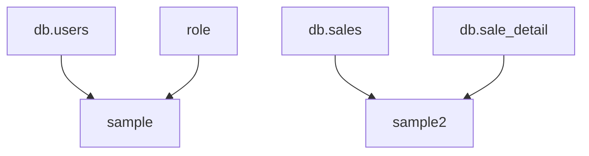

# alisql
[](https://github.com/yujikawa/alisql/actions/workflows/test.yml)
[](https://crates.io/crates/alisql)
[](https://docs.rs/alisql)

This is library to analize SQL with jinja template.

## Example
### Get dependecies
First, create sql like Jinja.

```sql
-- src/sample_sqls/sample.sql
select 
u.*
, r.* 
from {{ ref("db", "users") }} as u
left join {{ ref("role") }} as r on
u.id = r.user_id
```

```sql
-- src/sample_sqls/sample2.sql
select 
u.*
, r.* 
from {{ ref("db", "sales") }} as u
left join {{ ref("db", "sale_detail") }} as r on
u.id = r.sale_id
```

Use alias lib from main function. 

```rust
use alias;
fn main() {
    let d = alias::get_dependencies("src/sample_sqls") 
}
```

Result is..

```rust
d = [
    Table {
        table: "sample",
        sql: SQL {
            path: "src/sample_sqls/sample.sql",
            query: "select \nu.*\n, r.* \nfrom {{ ref(\"db\", \"users\") }} as u\nleft join {{ ref(\"role\") }} as r on\nu.id = r.user_id",
        },
        depends_on: [
            "db.users",
            "role",
        ],
    },
    Table {
        table: "sample2",
        sql: SQL {
            path: "src/sample_sqls/sample2.sql",
            query: "select \nu.*\n, r.* \nfrom {{ ref(\"db\", \"sales\") }} as u\nleft join {{ ref(\"db\", \"sale_detail\") }} as r on\nu.id = r.sale_id",
        },
        depends_on: [
            "db.sales",
            "db.sale_detail",
        ],
    },
]
```

### Get mermaid graph
```rust
use alisql;

fn main() {
    let m = alisql::get_mermaid("src/sample_sqls", "TD");
    println!("{}", m);
}
```

Variable m is 

```
graph TD;
db.users --> sample;
role --> sample;
db.sales --> sample2;
db.sale_detail --> sample2;
```

This is shown in the following graph.

