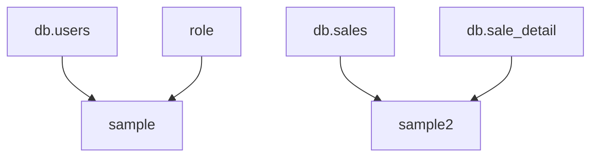

# alisql
[](https://github.com/yujikawa/alisql/actions/workflows/test.yml)
[](https://crates.io/crates/alisql)
[](https://docs.rs/alisql)

A tool for analyzing SQL files that use Jinja2 `{{ ref() }}` macros, extracting table dependencies and visualizing them as graphs.

---

## Installation

```bash
cargo install alisql
```

Or download a pre-built binary for your platform from [Releases](https://github.com/yujikawa/alisql/releases).

---

## CLI

### deps — Show dependencies

```bash
# Text format (default)
alisql deps ./sql

# JSON format
alisql deps ./sql --format json

# Limit search depth (default: 5)
alisql deps ./sql --max-depth 3
```

**Output (text):**
```
[sample]
  <- db.users
  <- role
[sample2]
  <- db.sales
  <- db.sale_detail
```

**Output (json):**
```json
[
  {
    "table": "sample",
    "depends_on": ["db.users", "role"]
  },
  {
    "table": "sample2",
    "depends_on": ["db.sales", "db.sale_detail"]
  }
]
```

---

### graph — Generate a Mermaid diagram

```bash
# Default orientation (top-down: TD)
alisql graph ./sql

# Specify orientation (TB / TD / BT / RL / LR)
alisql graph ./sql --orientation lr
```

**Output:**
```
graph TD;
db.users --> sample;
role --> sample;
db.sales --> sample2;
db.sale_detail --> sample2;
```

Rendered as a Mermaid diagram:


```mermaid
graph TD;
db.users --> sample;
role --> sample;
db.sales --> sample2;
db.sale_detail --> sample2;
```

---

## Using as a Rust library

```toml
# Cargo.toml
[dependencies]
alisql = "0.2"
```

### Get dependencies

```rust
let tables = alisql::get_dependencies("./sql", 5);
for table in &tables {
    println!("{} depends on {:?}", table.table, table.depends_on);
}
```

### Get a Mermaid diagram

```rust
let graph = alisql::get_mermaid("./sql", "TD", 5);
println!("{}", graph);
```

---

## Writing SQL files

Reference dependent tables using `{{ ref("table") }}` or `{{ ref("schema", "table") }}`.

```sql
-- sql/orders.sql
select o.*, u.name
from {{ ref("db", "orders") }} as o
left join {{ ref("users") }} as u on o.user_id = u.id
```

Analyzing this file reveals that the `orders` table depends on `db.orders` and `users`.
