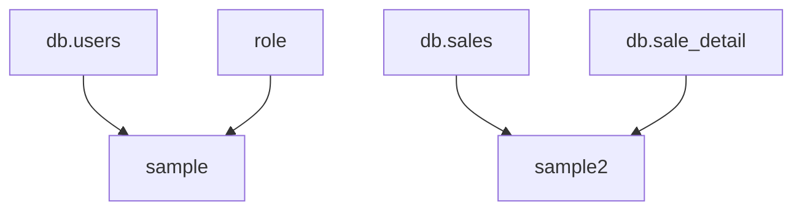

# alisql
[](https://github.com/yujikawa/alisql/actions/workflows/test.yml)
[](https://crates.io/crates/alisql)
[](https://docs.rs/alisql)

SQL ファイル内の Jinja2 `{{ ref() }}` マクロを解析して、テーブル間の依存関係を抽出・可視化するツールです。

---

## インストール

```bash
cargo install alisql
```

または [Releases](https://github.com/yujikawa/alisql/releases) からプラットフォーム別のバイナリをダウンロードできます。

---

## CLI

### deps — 依存関係を表示

```bash
# テキスト形式（デフォルト）
alisql deps ./sql

# JSON形式
alisql deps ./sql --format json

# 探索する深さを指定（デフォルト: 5）
alisql deps ./sql --max-depth 3
```

**出力例（text）:**
```
[sample]
  <- db.users
  <- role
[sample2]
  <- db.sales
  <- db.sale_detail
```

**出力例（json）:**
```json
[
  {
    "table": "sample",
    "depends_on": ["db.users", "role"]
  },
  {
    "table": "sample2",
    "depends_on": ["db.sales", "db.sale_detail"]
  }
]
```

---

### graph — Mermaid 図を出力

```bash
# デフォルト（上から下: TD）
alisql graph ./sql

# 向きを指定（TB / TD / BT / RL / LR）
alisql graph ./sql --orientation lr
```

**出力例:**
```
graph TD;
db.users --> sample;
role --> sample;
db.sales --> sample2;
db.sale_detail --> sample2;
```

GitHub や Notion などで Mermaid をレンダリングすると、次のようなグラフになります。


```mermaid
graph TD;
db.users --> sample;
role --> sample;
db.sales --> sample2;
db.sale_detail --> sample2;
```

---

## Rust ライブラリとして使う

```toml
# Cargo.toml
[dependencies]
alisql = "0.2"
```

### 依存関係を取得

```rust
let tables = alisql::get_dependencies("./sql", 5);
for table in &tables {
    println!("{} depends on {:?}", table.table, table.depends_on);
}
```

### Mermaid 図を取得

```rust
let graph = alisql::get_mermaid("./sql", "TD", 5);
println!("{}", graph);
```

---

## SQL ファイルの書き方

`{{ ref("table") }}` または `{{ ref("schema", "table") }}` の形式で依存テーブルを参照します。

```sql
-- sql/orders.sql
select o.*, u.name
from {{ ref("db", "orders") }} as o
left join {{ ref("users") }} as u on o.user_id = u.id
```

このファイルを解析すると、`orders` テーブルが `db.orders` と `users` に依存していることが分かります。
